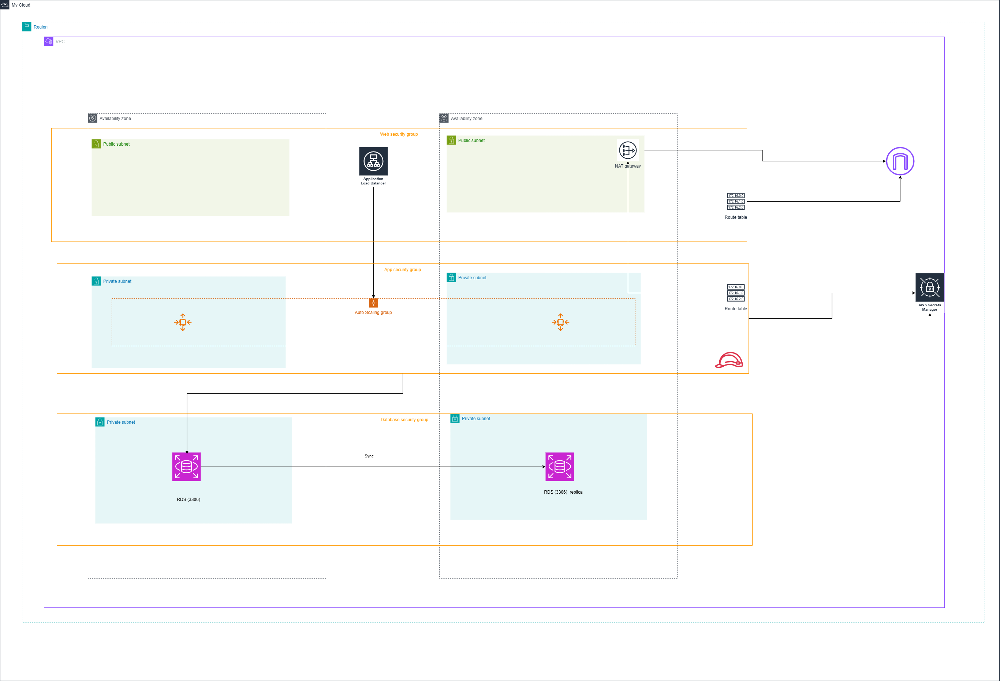

# 3-Tier AWS Architecture with Terraform

[](https://www.terraform.io/)
[](https://aws.amazon.com/)
[](LICENSE)

A production-ready, highly available 3-tier web application infrastructure deployed on AWS using Terraform modules.

## 📋 Table of Contents

- [Architecture Overview](#architecture-overview)
- [Architecture Diagram](#architecture-diagram)
- [Features](#features)
- [Prerequisites](#prerequisites)
- [Module Descriptions](#module-descriptions)
- [Project Structure](#project-structure)
- [Deployment Instructions](#deployment-instructions)
- [Variables](#variables)
- [Outputs](#outputs)
- [Testing Connectivity](#testing-connectivity)
- [Cost Optimization](#cost-optimization)
- [Troubleshooting](#troubleshooting)
- [Cleanup](#cleanup)
- [Security Considerations](#security-considerations)
- [Contributing](#contributing)

## 🏗 Architecture Overview

This project implements a secure, scalable 3-tier architecture on AWS following best practices for high availability and security:

### Tier 1: Presentation Layer (Web Tier)
- **Components**: Application Load Balancer (ALB), Public Subnets
- **Purpose**: Distributes incoming HTTP/HTTPS traffic across application instances
- **Availability**: Deployed across 2 Availability Zones for fault tolerance
- **Access**: Public internet-facing with security groups restricting traffic to HTTP/HTTPS

### Tier 2: Application Layer (App Tier)
- **Components**: EC2 Auto Scaling Group (ASG) or EC2 instances, Private Subnets
- **Purpose**: Hosts application logic and business processes
- **Availability**: Spans 2 Availability Zones with auto-scaling capabilities
- **Access**: Private subnets with outbound internet access via NAT Gateway

### Tier 3: Data Layer (Database Tier)
- **Components**: RDS MySQL/PostgreSQL, Private DB Subnets
- **Purpose**: Manages persistent data storage
- **Availability**: Multi-AZ deployment option for automatic failover
- **Access**: Isolated in private subnets, accessible only from application tier

### Network Architecture
- **VPC**: Isolated virtual network environment
- **Subnets**: 6 subnets total (2 public, 2 private app, 2 private DB)
- **Internet Gateway**: Enables public subnet internet access
- **NAT Gateway**: Provides outbound internet access for private subnets
- **Route Tables**: Custom routing for each tier

## 🗺 Architecture Diagram



## ✨ Features

- **Modular Design**: Reusable Terraform modules for each component
- **High Availability**: Multi-AZ deployment across all tiers
- **Auto Scaling**: Dynamic scaling based on traffic patterns (ASG option)
- **Security**: Defense-in-depth with security groups at each tier
- **Monitoring Ready**: Tagged resources for easy CloudWatch integration
- **Cost Optimized**: Efficient resource allocation with scaling capabilities
- **Infrastructure as Code**: Fully automated deployment and teardown
- **Parameterized**: No hardcoded values, fully customizable via variables

## 📦 Prerequisites

Before deploying this infrastructure, ensure you have:

### Required Tools
- **Terraform**: Version 1.0 or higher ([Install Guide](https://developer.hashicorp.com/terraform/install))
- **AWS CLI**: Version 2.x ([Install Guide](https://docs.aws.amazon.com/cli/latest/userguide/getting-started-install.html))
- **Git**: For cloning the repository

### AWS Requirements
- **AWS Account**: Active AWS account with appropriate permissions
- **IAM Permissions**: User/role with permissions to create:
  - VPC, Subnets, Route Tables, Internet Gateway, NAT Gateway
  - EC2 instances, Auto Scaling Groups, Launch Templates
  - Application Load Balancers, Target Groups
  - RDS instances, DB Subnet Groups
  - Security Groups
  - IAM roles (if using instance profiles)

### AWS CLI Configuration
```bash
aws configure
# Provide your AWS Access Key ID, Secret Access Key, region, and output format
```

### Verify Installation
```bash
terraform --version
aws --version
aws sts get-caller-identity  # Verify AWS credentials
```

## 🧩 Module Descriptions

### 1. Networking Module (`modules/networking`)

Creates the foundational network infrastructure for the 3-tier architecture.

**Resources Created:**
- 1 VPC with customizable CIDR block
- 2 Public subnets (for ALB and optional bastion host)
- 2 Private application subnets (for EC2/ASG)
- 2 Private database subnets (for RDS)
- 1 Internet Gateway (IGW)
- 1 NAT Gateway with Elastic IP
- 3 Route tables (public, private app, private DB)
- Route table associations for all subnets

**Key Variables:**
- `vpc_cidr`: VPC CIDR block (e.g., "10.0.0.0/16")
- `public_subnet_cidrs`: List of public subnet CIDRs
- `private_app_subnet_cidrs`: List of private app subnet CIDRs
- `private_db_subnet_cidrs`: List of private DB subnet CIDRs
- `availability_zones`: List of AZs to use

**Outputs:**
- `vpc_id`: VPC identifier
- `public_subnet_ids`: List of public subnet IDs
- `private_app_subnet_ids`: List of private app subnet IDs
- `private_db_subnet_ids`: List of private DB subnet IDs
- `public_route_table_id`: Public route table ID
- `private_route_table_id`: Private route table ID

---

### 2. Security Module (`modules/security`)

Manages security groups with least-privilege access controls for each tier.

**Resources Created:**
- **Web Security Group**: Controls ALB traffic
  - Ingress: HTTP (80), HTTPS (443), ICMP from 0.0.0.0/0
  - Egress: All traffic
  
- **App Security Group**: Controls EC2/ASG traffic
  - Ingress: HTTP (80) from Web SG, SSH (22) from Bastion SG (optional), ICMP from Web SG
  - Egress: All traffic
  
- **DB Security Group**: Controls RDS traffic
  - Ingress: MySQL/PostgreSQL (3306/5432) from App SG
  - Egress: All traffic

**Key Variables:**
- `vpc_id`: VPC where security groups will be created
- `allowed_ssh_cidr`: CIDR blocks allowed SSH access (for bastion)
- `db_port`: Database port (3306 for MySQL, 5432 for PostgreSQL)

**Outputs:**
- `web_sg_id`: Web tier security group ID
- `app_sg_id`: Application tier security group ID
- `db_sg_id`: Database tier security group ID

---

### 3. ALB Module (`modules/alb`)

Deploys an Application Load Balancer to distribute traffic across application instances.

**Resources Created:**
- Application Load Balancer (internet-facing)
- Target Group (HTTP, health check configured)
- HTTP Listener on port 80 (or HTTPS on port 443)
- Optional: Target attachments for EC2 instances

**Key Variables:**
- `alb_name`: Name for the load balancer
- `vpc_id`: VPC ID for target group
- `public_subnet_ids`: Subnets where ALB will be deployed
- `security_group_ids`: List of security groups (web SG)
- `target_group_port`: Backend port (default: 80)
- `health_check_path`: Health check endpoint (default: "/")
- `health_check_interval`: Health check frequency in seconds

**Outputs:**
- `alb_dns_name`: DNS name of the load balancer
- `alb_arn`: ALB Amazon Resource Name
- `target_group_arn`: Target group ARN for ASG attachment
- `alb_zone_id`: Hosted zone ID for Route53 integration

---

### 4. Compute Module (`modules/compute`)

Provisions EC2 instances with Auto Scaling capabilities for the application tier.

**Resources Created:**

- Launch Template with user data
- Auto Scaling Group (desired: 2, min: 1, max: 4)
- Scaling policies (optional: CPU-based)
- Instance profile (if needed)


**Key Variables:**
- `instance_type`: EC2 instance type (e.g., "t3.micro")
- `ami_id`: Amazon Machine Image ID (from data source)
- `subnet_ids`: List of subnet IDs for instance placement
- `security_group_ids`: List of security groups
- `key_name`: SSH key pair name (optional)
- `user_data`: Initialization script (base64 encoded)
- `min_size`: Minimum ASG instances (ASG option)
- `max_size`: Maximum ASG instances (ASG option)
- `desired_capacity`: Desired ASG instances (ASG option)
- `target_group_arns`: ALB target group ARNs for ASG

**Outputs:**
- `asg_name`: Auto Scaling Group name (ASG option)
- `asg_arn`: Auto Scaling Group ARN (ASG option)
- `launch_template_id`: Launch template ID
- `instance_ids`: EC2 instance IDs (static option)

---

### 5. Database Module (`modules/database`)

Deploys a managed RDS instance for the data tier.

**Resources Created:**
- RDS DB instance (MySQL or PostgreSQL)
- DB subnet group spanning private DB subnets
- DB parameter group (optional)
- Enhanced monitoring role (optional)

**Key Variables:**
- `db_engine`: Database engine ("mysql" or "postgres")
- `db_engine_version`: Engine version (e.g., "8.0" for MySQL)
- `db_instance_class`: Instance type (e.g., "db.t3.micro")
- `db_name`: Initial database name
- `db_username`: Master username
- `db_password`: Master password (use AWS Secrets Manager in production)
- `allocated_storage`: Storage size in GB
- `storage_type`: Storage type ("gp3" recommended)
- `multi_az`: Enable Multi-AZ deployment (true/false)
- `backup_retention_period`: Automated backup retention in days
- `subnet_ids`: List of private DB subnet IDs
- `vpc_security_group_ids`: List of security groups (DB SG)
- `skip_final_snapshot`: Skip final snapshot on deletion (true for dev)

**Outputs:**
- `db_instance_endpoint`: RDS endpoint for connections
- `db_instance_address`: RDS hostname
- `db_instance_port`: Database port
- `db_instance_id`: RDS instance identifier
- `db_subnet_group_name`: DB subnet group name

---

### 6. Secrets Module (`modules/secrets`)

Securely manages sensitive database credentials using AWS Secrets Manager.

**Resources Created:**
- **DB Password Secret**: Complete database connection information
  - Username, password, engine type, host, port, database name
  
- **DB Credentials Secret**: Simplified username/password storage
  - Lightweight credential storage for basic authentication

**Key Variables:**
- `project`: Project name for secret naming
- `environment`: Environment tag (dev, staging, prod)
- `db_username`: Database master username
- `db_password`: Database master password
- `db_host`: RDS endpoint hostname
- `db_port`: Database port number
- `db_name`: Database name
- `tags`: Resource tags

**Outputs:**
- `db_password_secret_arn`: ARN of the password secret
- `db_password_secret_name`: Name of the password secret
- `db_credentials_secret_arn`: ARN of the credentials secret
- `db_credentials_secret_name`: Name of the credentials secret

**Security Features:**
- 7-day recovery window for accidental deletion protection
- JSON-encoded secrets for structured data storage
- IAM-based access control
- Automatic secret rotation support (can be configured)
- Audit trail through CloudTrail integration

## 📁 Project Structure

```
3tier-project/
├── images/
│   └── 3tier.png                    # Architecture diagram
├── modules/
│   ├── networking/
│   │   ├── main.tf                  # VPC, subnets, IGW, NAT, route tables
│   │   ├── variables.tf             # Input variables
│   │   └── outputs.tf               # Module outputs
│   ├── security/
│   │   ├── main.tf                  # Security groups and rules
│   │   ├── variables.tf             # Input variables
│   │   └── outputs.tf               # Security group IDs
│   ├── alb/
│   │   ├── main.tf                  # ALB, target group, listeners
│   │   ├── variables.tf             # Input variables
│   │   └── outputs.tf               # ALB DNS, ARNs
│   ├── compute/
│   │   ├── main.tf                  # ASG, launch template, or EC2 instances
│   │   ├── variables.tf             # Input variables
│   │   └── outputs.tf               # ASG/instance information
│   ├── database/
│   │   ├── main.tf                  # RDS instance, subnet group
│   │   ├── variables.tf             # Input variables
│   │   └── outputs.tf               # RDS endpoint, connection info
│   └── secrets/
│       ├── main.tf                  # AWS Secrets Manager for DB credentials
│       ├── variables.tf             # Input variables
│       └── outputs.tf               # Secret ARNs and names
├── main.tf                          # Root module - calls all child modules
├── provider.tf                      # AWS provider configuration
├── variables.tf                     # Root-level input variables
├── outputs.tf                       # Root-level outputs
├── terraform.tfvars                 # Variable values (DO NOT commit sensitive data)
├── .gitignore                       # Git ignore file
├── README.md                        # This file
└── LICENSE                          # Project license
```

## 🚀 Deployment Instructions

### Step 1: Clone the Repository

```bash
git clone https://github.com/Asheryram/Devops_tf.git
cd Devops_tf
```

### Step 2: Configure Variables

Create a `terraform.tfvars` file in the root directory:

```hcl
# General Configuration
project_name = "3tier-iac"
environment  = "dev"
owner        = "your-name"
aws_region   = "us-east-1"

# Networking Configuration
vpc_cidr                  = "10.0.0.0/16"
availability_zones        = ["us-east-1a", "us-east-1b"]
public_subnet_cidrs       = ["10.0.1.0/24", "10.0.2.0/24"]
private_app_subnet_cidrs  = ["10.0.11.0/24", "10.0.12.0/24"]
private_db_subnet_cidrs   = ["10.0.21.0/24", "10.0.22.0/24"]

# Compute Configuration
instance_type     = "t3.micro"
key_name          = "your-key-pair"  # Optional: for SSH access
min_size          = 1
max_size          = 4
desired_capacity  = 2

# Database Configuration
db_engine              = "mysql"
db_engine_version      = "8.0"
db_instance_class      = "db.t3.micro"
db_name                = "appdb"
db_username            = "admin"
db_password            = "ChangeThisPassword123!"  # Stored securely in Secrets Manager
allocated_storage      = 20
multi_az               = false  # Set to true for production
backup_retention_period = 7
skip_final_snapshot    = true   # Set to false for production
```

**⚠️ Security Note**: Database credentials are automatically stored in AWS Secrets Manager. The password in `terraform.tfvars` is only used during initial deployment and is then securely managed by AWS Secrets Manager. For production environments, consider using AWS Secrets Manager rotation.

### Step 3: Initialize Terraform

```bash
terraform init
```

This command:
- Downloads required provider plugins (AWS)
- Initializes the backend
- Prepares modules for use

### Step 4: Validate Configuration

```bash
terraform validate
```

Checks for syntax errors and configuration issues.

### Step 5: Plan Deployment

```bash
terraform plan -out=tfplan
```

This generates an execution plan showing:
- Resources to be created, modified, or destroyed
- Estimated costs (if using cost estimation tools)

Review the plan carefully before proceeding.

### Step 6: Apply Configuration

```bash
terraform apply tfplan
```

Or interactively:

```bash
terraform apply
```

Type `yes` when prompted to confirm deployment.

**Deployment Time**: Approximately 10-15 minutes depending on resources.

### Step 7: Save Outputs

```bash
terraform output
```

Save the ALB DNS name and RDS endpoint for testing.

Example output:
```
alb_dns = "3tier-alb-1234567890.us-east-1.elb.amazonaws.com"
rds_endpoint = "3tier-db.abc123xyz.us-east-1.rds.amazonaws.com:3306"
asg_name = "3tier-app-asg"
db_secret_arn = "arn:aws:secretsmanager:us-east-1:123456789012:secret:3tier-dev-db-password-AbCdEf"
```

## 🔒 Security Best Practices

### Secrets Management

This project uses **AWS Secrets Manager** to securely store database credentials:

1. **Automatic Secret Creation**: Database passwords are stored in Secrets Manager during deployment
2. **Two Secret Types**:
   - **Full Connection Secret**: Contains username, password, host, port, database name, and engine type
   - **Credentials Secret**: Simplified username/password storage

### Retrieving Secrets

**Using AWS CLI:**
```bash
# Get the full database connection details
aws secretsmanager get-secret-value \
  --secret-id 3tier-dev-db-password \
  --query SecretString \
  --output text | jq .

# Get just the credentials
aws secretsmanager get-secret-value \
  --secret-id 3tier-dev-db-credentials \
  --query SecretString \
  --output text | jq .
```

**Using Terraform Data Source:**
```hcl
data "aws_secretsmanager_secret_version" "db_password" {
  secret_id = "3tier-dev-db-password"
}

locals {
  db_creds = jsondecode(data.aws_secretsmanager_secret_version.db_password.secret_string)
}

# Access values: local.db_creds.username, local.db_creds.password
```

**In Application Code (Python Example):**
```python
import boto3
import json

def get_db_credentials():
    client = boto3.client('secretsmanager', region_name='us-east-1')
    response = client.get_secret_value(SecretId='3tier-dev-db-password')
    return json.loads(response['SecretString'])

creds = get_db_credentials()
# Use creds['username'], creds['password'], creds['host'], etc.
```

### Additional Security Measures

- **IAM Policies**: Grant EC2 instances IAM roles with minimal permissions to access secrets
- **Encryption**: All secrets are encrypted at rest using AWS KMS
- **Audit Logging**: Secret access is logged in CloudTrail
- **Recovery Window**: 7-day recovery window protects against accidental deletion
- **Rotation**: Enable automatic secret rotation for production environments

### Network Security

- **Private Subnets**: Application and database tiers are isolated from direct internet access
- **Security Groups**: Implement defense-in-depth with layered security groups
- **NAT Gateway**: Provides controlled outbound internet access
- **No Public IPs**: EC2 and RDS instances have no public IP addresses

### IAM Best Practices

Grant EC2 instances only the permissions they need:

```hcl
# Example IAM policy for EC2 to access secrets
{
  "Version": "2012-10-17",
  "Statement": [
    {
      "Effect": "Allow",
      "Action": [
        "secretsmanager:GetSecretValue"
      ],
      "Resource": "arn:aws:secretsmanager:*:*:secret:3tier-*"
    }
  ]
}
```

## 📊 Outputs

The root module provides the following outputs after successful deployment:

| Output Name | Description | Example Value |
|------------|-------------|---------------|
| `alb_dns` | ALB DNS name for accessing the application | `3tier-alb-123.us-east-1.elb.amazonaws.com` |
| `alb_zone_id` | ALB hosted zone ID for Route53 | `Z35SXDOTRQ7X7K` |
| `rds_endpoint` | RDS endpoint for database connections | `mydb.abc123.us-east-1.rds.amazonaws.com:3306` |
| `rds_address` | RDS hostname without port | `mydb.abc123.us-east-1.rds.amazonaws.com` |
| `asg_name` | Auto Scaling Group name | `3tier-app-asg` |
| `vpc_id` | VPC identifier | `vpc-0123456789abcdef0` |
| `db_secret_arn` | Secrets Manager ARN for database password | `arn:aws:secretsmanager:us-east-1:123456789012:secret:3tier-dev-db-password-AbCdEf` |
| `db_credentials_secret_arn` | Secrets Manager ARN for DB credentials | `arn:aws:secretsmanager:us-east-1:123456789012:secret:3tier-dev-db-credentials-XyZaBc` |

## 🔍 Variables

### Required Variables

| Variable | Type | Description |
|----------|------|-------------|
| `project_name` | string | Project name used for resource naming |
| `environment` | string | Environment (dev, staging, prod) |
| `owner` | string | Resource owner name |
| `aws_region` | string | AWS region for deployment |
| `vpc_cidr` | string | CIDR block for VPC |
| `availability_zones` | list(string) | List of availability zones |
| `public_subnet_cidrs` | list(string) | CIDR blocks for public subnets |
| `private_app_subnet_cidrs` | list(string) | CIDR blocks for app subnets |
| `private_db_subnet_cidrs` | list(string) | CIDR blocks for DB subnets |
| `instance_type` | string | EC2 instance type |
| `db_username` | string | Database master username |
| `db_password` | string | Database master password (stored in Secrets Manager) |

### Optional Variables

| Variable | Type | Default | Description |
|----------|------|---------|-------------|
| `key_name` | string | `null` | SSH key pair name |
| `min_size` | number | `1` | Minimum ASG instances |
| `max_size` | number | `4` | Maximum ASG instances |
| `desired_capacity` | number | `2` | Desired ASG instances |
| `db_engine` | string | `"mysql"` | Database engine |
| `db_instance_class` | string | `"db.t3.micro"` | RDS instance type |
| `multi_az` | bool | `false` | Enable Multi-AZ |
| `backup_retention_period` | number | `7` | Backup retention days |

## 🧪 Testing Connectivity

### 1. Test ALB Connectivity

```bash
# Get ALB DNS name
ALB_DNS=$(terraform output -raw alb_dns)

# Test HTTP connectivity
curl http://$ALB_DNS

# Expected: HTTP 200 response from application
```

### 2. Test ICMP (Ping) from Bastion to Application Server

**Prerequisites**: Deploy a bastion host in a public subnet

```bash
# SSH into bastion host
ssh -i your-key.pem ec2-user@<bastion-public-ip>

# Ping application server (use private IP from EC2 console)
ping <app-server-private-ip>

# Expected output:
# 64 bytes from 10.0.11.x: icmp_seq=1 ttl=64 time=0.5 ms
```

### 3. Test Database Connectivity from Application Server

```bash
# SSH to bastion, then jump to app server
ssh -i your-key.pem ec2-user@<app-server-private-ip>

# Get database credentials from Secrets Manager
DB_SECRET=$(aws secretsmanager get-secret-value \
  --secret-id 3tier-dev-db-password \
  --query SecretString \
  --output text)

# Parse credentials
DB_HOST=$(echo $DB_SECRET | jq -r '.host')
DB_USER=$(echo $DB_SECRET | jq -r '.username')
DB_PASS=$(echo $DB_SECRET | jq -r '.password')
DB_NAME=$(echo $DB_SECRET | jq -r '.dbname')

# Test MySQL connection
mysql -h $DB_HOST -u $DB_USER -p$DB_PASS -e "SHOW DATABASES;"

# Expected: List of databases including your database name
```

### 4. Health Check Verification

```bash
# Check ALB target health
aws elbv2 describe-target-health \
  --target-group-arn $(terraform output -raw target_group_arn)

# Expected output shows targets as "healthy"
```

### 5. End-to-End Application Test

Deploy a simple web application on EC2 instances:

```bash
# User data script for EC2 (add to compute module)
#!/bin/bash
yum update -y
yum install -y httpd
systemctl start httpd
systemctl enable httpd

# Fetch DB credentials from Secrets Manager
DB_SECRET=$(aws secretsmanager get-secret-value \
  --secret-id 3tier-dev-db-password \
  --query SecretString \
  --output text \
  --region us-east-1)

echo "<h1>3-Tier Application</h1>" > /var/www/html/index.html
echo "<p>Instance ID: $(ec2-metadata --instance-id | cut -d ' ' -f 2)</p>" >> /var/www/html/index.html
echo "<p>Database: Connected</p>" >> /var/www/html/index.html
```

Then test:
```bash
curl http://$(terraform output -raw alb_dns)
```

## 💰 Cost Optimization

### Estimated Monthly Costs (us-east-1)

| Resource | Configuration | Estimated Cost |
|----------|--------------|----------------|
| NAT Gateway | 1x NAT Gateway + data transfer (10GB) | ~$35/month |
| EC2 Instances | 2x t3.micro (Auto Scaling) | ~$15/month |
| RDS | 1x db.t3.micro MySQL (Single-AZ) | ~$15/month |
| ALB | Application Load Balancer | ~$23/month |
| EBS Volumes | 2x 8GB gp3 (EC2) + 20GB gp3 (RDS) | ~$5/month |
| Secrets Manager | 2 secrets | ~$1/month |
| **Total** | | **~$94/month** |

### Cost Saving Tips

1. **Use Spot Instances**: For non-production environments
   ```hcl
   # In compute module
   instance_market_options {
     market_type = "spot"
   }
   ```

2. **Schedule Resources**: Stop EC2/RDS during non-business hours
   ```bash
   # Use AWS Instance Scheduler or EventBridge
   ```

3. **Right-size Instances**: Monitor CloudWatch and adjust instance types

4. **Reserved Instances**: For production workloads (1-3 year commitment)

5. **Single NAT Gateway**: Use one NAT Gateway instead of one per AZ for dev
   - Savings: ~$35/month
   - Trade-off: Reduced high availability

6. **Delete NAT Gateway**: For development, allow direct internet access
   - Savings: ~$35/month
   - Trade-off: Less production-like environment

## 🔧 Troubleshooting

### Issue: ALB returns 502/503 errors

**Cause**: Unhealthy targets in target group

**Solution**:
```bash
# Check target health
aws elbv2 describe-target-health \
  --target-group-arn <your-target-group-arn>

# Common fixes:
# 1. Verify security group allows traffic from ALB
# 2. Ensure application is running on EC2
# 3. Check health check path is accessible
# 4. Review EC2 instance logs: /var/log/messages
```

### Issue: Cannot connect to RDS from EC2

**Cause**: Security group or network configuration

**Solution**:
```bash
# Verify security groups
aws ec2 describe-security-groups --group-ids <db-security-group-id>

# Check inbound rules allow MySQL (3306) from app security group
# Verify EC2 and RDS are in correct subnets
# Test network connectivity: telnet <rds-endpoint> 3306
```

### Issue: Terraform state lock error

**Cause**: Previous operation didn't complete or crashed

**Solution**:
```bash
# If using S3 backend with DynamoDB locking
terraform force-unlock <lock-id>

# Or manually remove lock from DynamoDB table
```

### Issue: Cannot retrieve secrets from Secrets Manager

**Cause**: Missing IAM permissions

**Solution**:
```bash
# Attach IAM policy to EC2 instance role
aws iam put-role-policy \
  --role-name <ec2-role-name> \
  --policy-name SecretsManagerReadPolicy \
  --policy-document '{
    "Version": "2012-10-17",
    "Statement": [{
      "Effect": "Allow",
      "Action": "secretsmanager:GetSecretValue",
      "Resource": "arn:aws:secretsmanager:*:*:secret:3tier-*"
    }]
  }'
```

### Issue: NAT Gateway not working

**Cause**: Route table misconfiguration

**Solution**:
```bash
# Verify route tables
aws ec2 describe-route-tables --filters "Name=vpc-id,Values=<vpc-id>"

# Ensure private subnets have route: 0.0.0.0/0 -> NAT Gateway
# Public subnets should have route: 0.0.0.0/0 -> Internet Gateway
```

## 🧹 Cleanup

To avoid ongoing AWS charges, destroy all resources when no longer needed:

```bash
# Review what will be destroyed
terraform plan -destroy

# Destroy all resources
terraform destroy

# Confirm by typing: yes
```

**⚠️ Important**: 
- RDS deletion protection must be disabled
- If `skip_final_snapshot = false`, Terraform will create a final snapshot
- Secrets Manager secrets have a 7-day recovery window
- To force delete secrets immediately:
  ```bash
  aws secretsmanager delete-secret \
    --secret-id 3tier-dev-db-password \
    --force-delete-without-recovery
  ```

### Manual Cleanup (if terraform destroy fails)

1. Delete ALB and target groups
2. Terminate EC2 instances and delete Auto Scaling Groups
3. Delete RDS instances (wait for completion)
4. Delete NAT Gateway and release Elastic IPs
5. Delete subnets
6. Delete route tables
7. Detach and delete Internet Gateway
8. Delete VPC
9. Delete secrets from Secrets Manager

## 🛡 Security Considerations

### Production Recommendations

1. **Enable Multi-AZ for RDS**: High availability and automatic failover
2. **Use HTTPS**: Configure SSL/TLS certificates on ALB
3. **Enable RDS Encryption**: Encrypt data at rest
4. **Rotate Secrets**: Enable automatic secret rotation
5. **VPC Flow Logs**: Monitor network traffic
6. **CloudTrail**: Enable for audit logging
7. **WAF**: Add AWS WAF to ALB for application protection
8. **Backup Strategy**: Increase RDS backup retention
9. **Parameter Store**: Consider using Parameter Store for non-sensitive configs
10. **KMS Keys**: Use customer-managed KMS keys for encryption

### Secret Rotation Setup

```hcl
# Add to secrets module for automatic rotation
resource "aws_secretsmanager_secret_rotation" "db_password" {
  secret_id           = aws_secretsmanager_secret.db_password.id
  rotation_lambda_arn = aws_lambda_function.rotate_secret.arn

  rotation_rules {
    automatically_after_days = 30
  }
}
```

## 🤝 Contributing

Contributions are welcome! Please follow these steps:

1. Fork the repository
2. Create a feature branch: `git checkout -b feature/your-feature`
3. Commit changes: `git commit -am 'Add new feature'`
4. Push to branch: `git push origin feature/your-feature`
5. Submit a pull request

### Coding Standards

- Follow Terraform best practices
- Use meaningful variable and resource names
- Add comments for complex logic
- Update documentation for any changes
- Test changes in a dev environment before submitting PR

## 📄 License

This project is licensed under the MIT License - see the [LICENSE](LICENSE) file for details.

## 📞 Support

For issues, questions, or contributions:
- **GitHub Issues**: [Create an issue](https://github.com/yourusername/3tier-aws-terraform/issues)
- **Documentation**: [Terraform AWS Provider](https://registry.terraform.io/providers/hashicorp/aws/latest/docs)
- **AWS Support**: [AWS Documentation](https://docs.aws.amazon.com/)

## 🙏 Acknowledgments

- HashiCorp Terraform team for excellent IaC tooling
- AWS for comprehensive cloud services
- Open source community for best practices and examples

---

**Built with ❤️ and cash using Terraform and AWS**

*Last Updated: 22 January 2026*